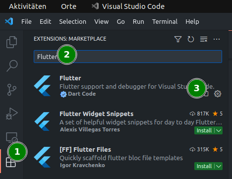
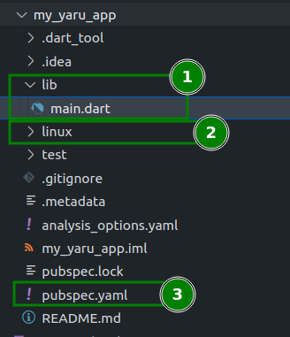
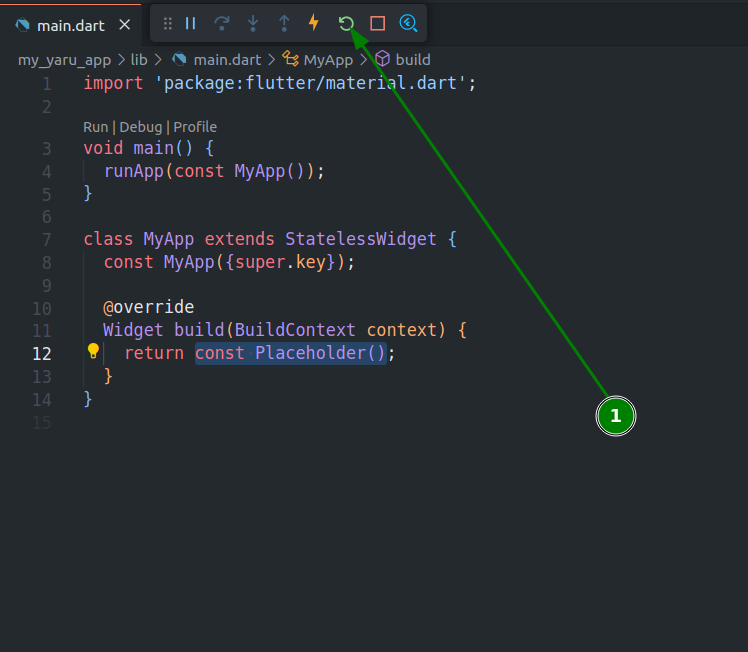
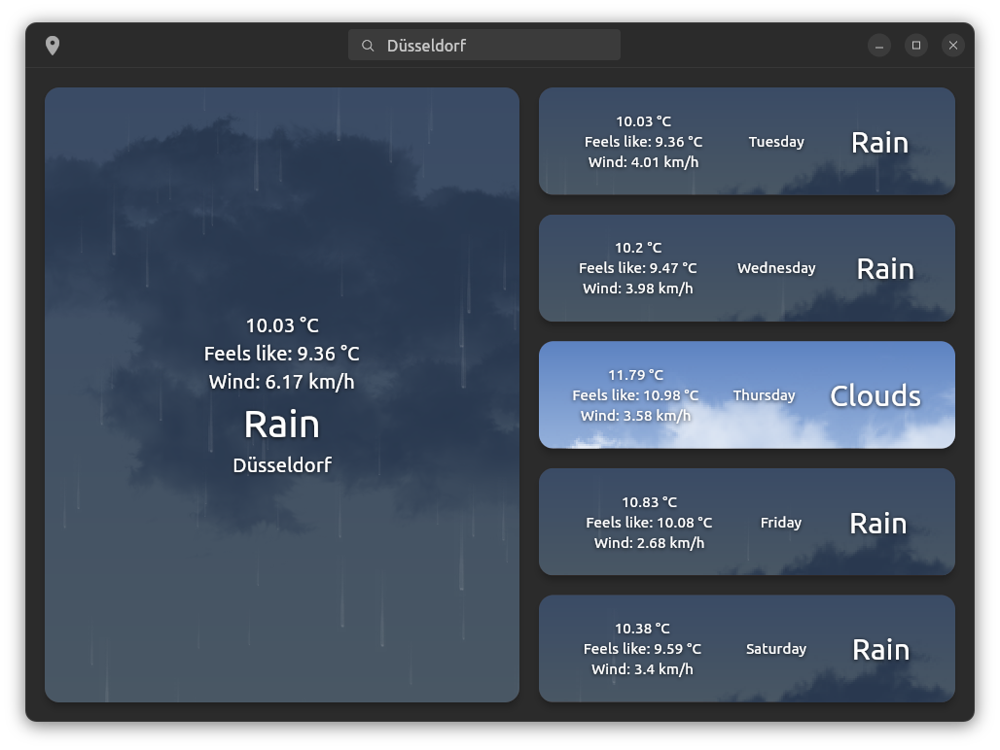

# How to create an Ubuntu Desktop Yaru application with Flutter

This is a **beginner** tutorial for those new to the Dart programming language, new to programming languages in general and new to the Yaru design.

## Intro

The preinstalled applications on Ubuntu are quite diverse in their programming language and tooling origins. Some examples are the Firefox internet browser and the Thunderbird e-mail client both being C++ and JavaScript applications, the Libre-Office suite being written in C++, XML, and Java and gnome-files (A.K.A. nautilus) which is written in C with gtk.

Another toolkit is [Flutter](https://flutter.dev/). Flutter is a multi platform toolkit written in C++ and dart.
The GUI of the new Ubuntu Desktop installer is made Flutter as well as the next iteration of Ubuntu Software plus there are hundreds of iOS, Android, Windows, Web and MacOS applications created with Flutter.

Over the past years we've designed and developed several dart libraries which make it easy to create Ubuntu Desktop applications with Flutter. This tutorial will make all of this less mystical for people not familiar with neither Flutter nor our dart libraries.

### What you will learn

- How to setup your Flutter development environment on Ubuntu
- Learn VsCode basics
- Get to know dart libraries to create an aesthetic and visually consistent desktop application
- Get to know dart libraries to interact with existing Free-Desktop and hardware related APIs on Ubuntu
- Create a starting point for either a multi-page, single-page or wizard-like desktop applications on Ubuntu

### Skill requirements

It should be an advantage if you have created an application before, preferable with [an object oriented language](https://en.wikipedia.org/wiki/Object-oriented_programming) and if you are not scared to copy and paste commands into your terminal. But since this is a step-by-stand, hands-on tutorial everyone with a bit of technical interest should do fine.

## Setup

### Install Flutter

If you want to create Android or Web applications with Flutter from your Ubuntu machine, all you need should be the flutter snap (`snap install flutter --classic`). However, this tutorial is about creating apps for the Ubuntu *Desktop*. Some of our dart libraries make use of native libraries which may not behave perfectly with the way the flutter snap interacts with your system.

The following lines will install the dependencies for Flutter Linux apps, create a directory in your home dir, clone the flutter git repository and export the `flutter` and `dart` commands to your path so you can run it from any user shell.

So please open up your terminal on Ubuntu by either pressing the key-combination CTRL + ALT + T or by searching for "Terminal" in your Ubuntu search. Now 

**either** copy & paste the following lines successively into your terminal and press enter after:

```bash
sudo apt install git curl cmake meson make clang libgtk-3-dev pkg-config
mkdir -p ~/development
cd ~/development
git clone https://github.com/flutter/flutter.git -b stable
echo 'export PATH="$PATH:$HOME/development/flutter/bin"' >> ~/.bashrc
source ~/.bashrc
```

**OR** use this one-liner to copy and paste everything into your terminal, :warning: this does not stop until it is done:

```bash
sudo apt -y install git curl cmake meson make clang libgtk-3-dev pkg-config && mkdir -p ~/development && cd ~/development && git clone https://github.com/flutter/flutter.git -b stable && echo 'export PATH="$PATH:$HOME/development/flutter/bin"' >> ~/.bashrc && source ~/.bashrc
```

### Install VsCode

Run the following command to install VsCode on your Ubuntu machine (or install it from Ubuntu Software):

```bash
sudo snap install code --classic
```

### Setup VsCode

Open VsCode, click on the extension icon in the left sidebar (1), type "Flutter" and click "Install" on the first entry (3), this should be the Flutter extension by Dart Code.



## Let's get started: flutter create

VsCode offers a command palette which you can open with either CTRL+SHIFT+P or by clicking on the :gear: icon 


We *could* now type "Flutter new project"


However, since we want to make amount of auto created files as small as possible to make the management as easy as possible, we want to specify the platforms for our new project.

Open the integrated terminal in vscode if it is not already opened


And run the following command to create a new Flutter project for Linux only (you can add more platforms at any point if you want) and specify the name of your organization/company and your appname:

```bash
flutter create --platforms=linux --org com.test my_yaru_app
```
Flutter created a small template app for us. Let's take a look at the three locations we need to visit first:



(1) Is the `lib` directory where all of our dart code lives. For now a single `main.dart` file should be enough. All platforms our app wants to be available for gets its own directory. In our case only the `Linux` directory (2). We will come this back later. To define metadata of our app and the dependencies we want to use we need the `pubspec.yaml` file (3).

### First run

Now click on `main.dart` (1) to open the file in your editor and click on the small `Run` label above the `void main()` declaration (2) to run the app for the first time


Caution, it is not pretty yet:


### Clean up

The Flutter template app is quite verbose explaining what it contains but we don't need most of the things in here for now. Delete everything in your main.dart file below line 5


Dart will now complain that the class `MyApp` does not exist any longer. Because we've just deleted it on purpose.


### First snipped: stle

The Flutter VsCode extensions is extremely helpful for almost any task and saves us a lot of lines to write. There are quick commands, snippets, auto-complete and auto fix features available which we will use in this tutorial.
The first help we will use is the snippet `stle` which is short for `StatelessWidget`.

Move below line 5 and write

`stle` 

Now a popup should ... pop-up. (if not press CTRL+ENTER, if this does not help either, there is something wrong with your setup of vscode, flutter and the Flutter VsCode extension).

(1) is your text and the cursor, (2) is the detected snippet `Flutter Stateless Widget` and (3) is a little explanation what will happen if you press ENTER now, which you please do now:


Something happened! Now please stay calm and look what you got. The created snippet left a multi-cursor in the places which change if you change the name of your `StatelessWidget`.


Just start writing now! Write `MyApp` and the text will be written into both places at once. When you are done press the ESC key on your keyboard to stop the multi-cursor. Pressing CTRL+S will save your code and the changes will be hot-reloaded immediately into your app:


Every time you save your code by either pressing CTRL+S or by the menu entry File->Save, Flutter will [Hot-Reload your changes right into your dart process](https://docs.flutter.dev/development/tools/hot-reload). This means that you do not need to re-run your app every time you change something in your code. However if you exchange bigger parts you might need to click on Restart



### First recap

(1) Imports the package `material.dart`

(2) Is the main application with the `runApp` [function call](https://dart.dev/language/functions).

(3) Is your [class](https://dart.dev/language/classes) `MyApp` which [extends](https://dart.dev/language/extend) the class [`StatelessWidget`](https://api.flutter.dev/flutter/widgets/StatelessWidget-class.html).
Extending this class forces your app to implement the [`Widget build(BuildContext context)`](https://api.flutter.dev/flutter/widgets/StatelessWidget/build.html) method, which you do by returning the Widget `PlaceHolder`.


### dart keywords used

- [import](https://dart.dev/language/libraries#using-libraries)
- [void](https://dart.dev/language/built-in-types)
- [const](https://dart.dev/language/variables#final-and-const)
- [class](https://dart.dev/language/classes)
- [extends](https://dart.dev/language/extend)
- [super](https://dart.dev/language/extend)
- [return](https://dart.dev/language/functions#return-values)


## Creating the app skeleton

### MaterialApp

Mark `const Placeholder`


and write `MaterialApp` which opens a popup with a suggested class, press ENTER to replace `PlaceHolder` with `MaterialApp()`


### Quick look into named parameters in dart

Don't code now, just read.

Functions in dart, as in any other modern programming language, can either have no or any kind and amount of [parameters](https://dart.dev/language/functions#parameters) (also called arguments or input variables). [*(In mathematics this is different. All functions must have at least one argument and a return value.)*](https://en.wikipedia.org/wiki/Function_(mathematics))

To make reading function calls easier dart has the optional feature of named [parameters](https://dart.dev/language/functions#parameters). Where a function, if defined with (a) named parameter(s), must be called by naming the parameter, followed by a `:` and the value that should be set.

Example definition without a named parameter:
```dart
int incrementByOne(int myParameter) {
    return myParameter + 1;
}
```

Calling the function:
```dart
incrementByOne(3);
```

Example definition with a named parameter:
```dart
int incrementByOne({required int myParameter}) {
    return myParameter + 1;
}
```

Calling the function:
```dart
incrementByOne(myParameter: 3);
```

To create an instance of a class one needs to call the [constructor](https://dart.dev/language/constructors) "function" (called method if part of a class).

Flutter widget classes almost always use named parameters, which is increasingly useful the more parameters a Widget has when you call its constructor method.

Example Widget definition:

```dart
class _MyNumberWidget extends StatelessWidget {
  // This is the constructor definition
  const _MyNumberWidget({required this.number});
  // This is your parameter of the type integer.
  final int number;

  @override
  Widget build(BuildContext context) {
    // using the parameter to be shown inside the UI
    return Text(number.toString());
  }
}
```

Somewhere else (where calling functions is allowed):
```dart
final Widget myNumberWidget = MyNumberWidget(number: 3)
```

#### New keywords learned

- [final](https://dart.dev/language/variables#final-and-const)
- [required](https://dart.dev/language/functions#named-parameters)

### Back to coding: Scaffold

Move your cursor inside the brackets of the `MaterialApp()` constructor call and insert

```dart
home:
```

VsCode then suggests:


Press enter, and write `Scaffold()`

VsCode then suggests:


Move the selection to `Scaffold()` by pressing your arrow-down key on your keyboard. Press enter when `Scaffold()` is selected.

Your code should now look like this:

```dart
import 'package:flutter/material.dart';

void main() {
  runApp(const MyApp());
}

class MyApp extends StatelessWidget {
  const MyApp({super.key});

  @override
  Widget build(BuildContext context) {
    return MaterialApp(home: Scaffold());
  }
}
```

*Note: it is always better to let VsCode do the work by only typing until the code-completion (they call it "intellisense") popup shows up with suggestions. Pressing enter while one of the suggestions is selected is always safer because you will avoid typing errors and because VsCode will often also make the necessary import for you, too. However, this was the last time we've written down the auto-complete-workflow, to not make this tutorial unnecessarily long.*

### pub.dev

### Dart: add dependencies

### Yaru.dart

### yaru_widgets.dart

### yaru_icons.dart

### hand_window.dart


## Types of apps + your ideas

Most of the desktop apps we've encountered could be classified into one of the following "concepts":

- Master/details apps
  
- single page apps *(the weather in Düsseldorf is kinda depressing atm)*
  
- wizard apps
  

That does not mean there aren't more types of apps and most importantly this should not limit your ideas and creativity in any way.